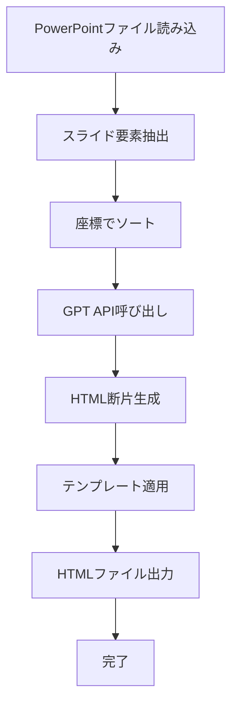
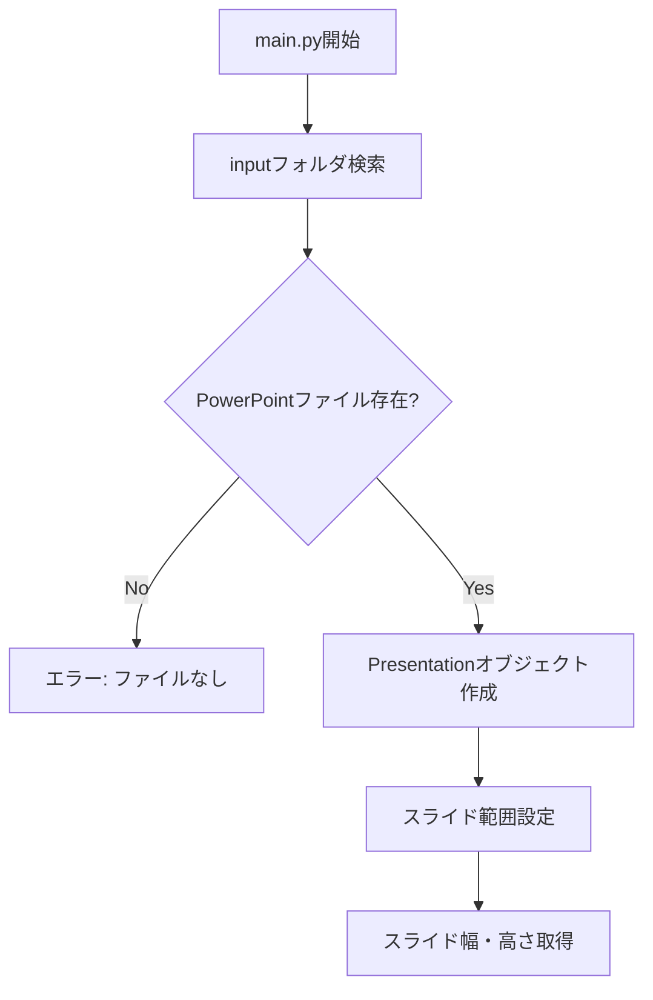
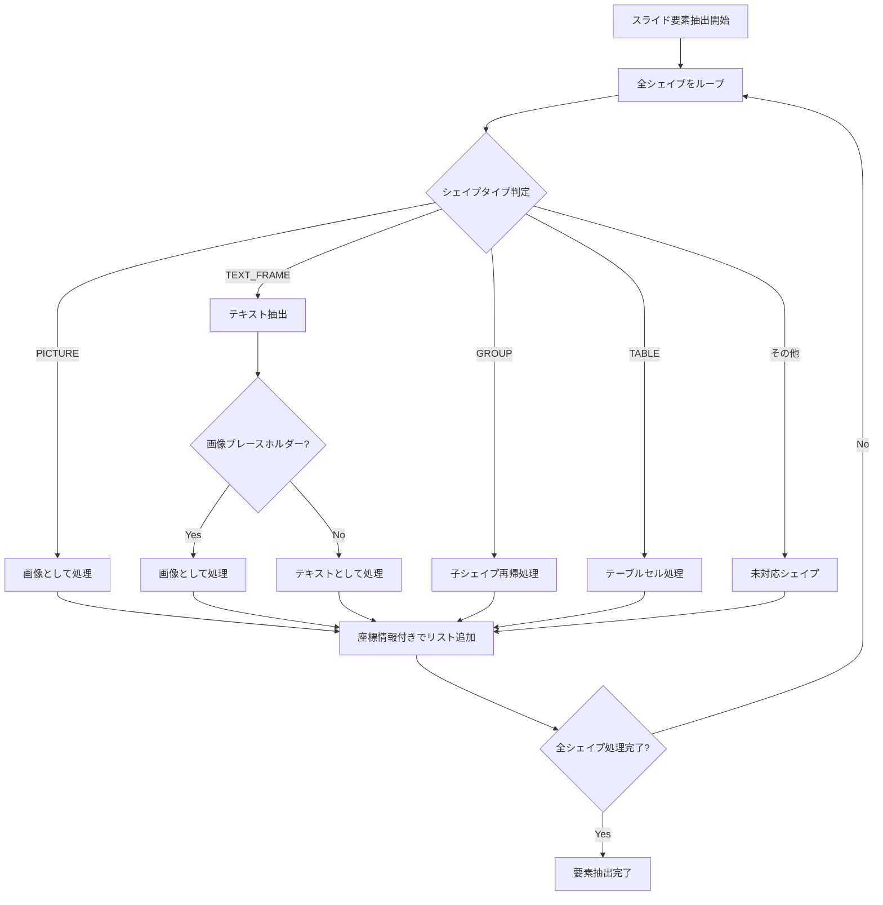
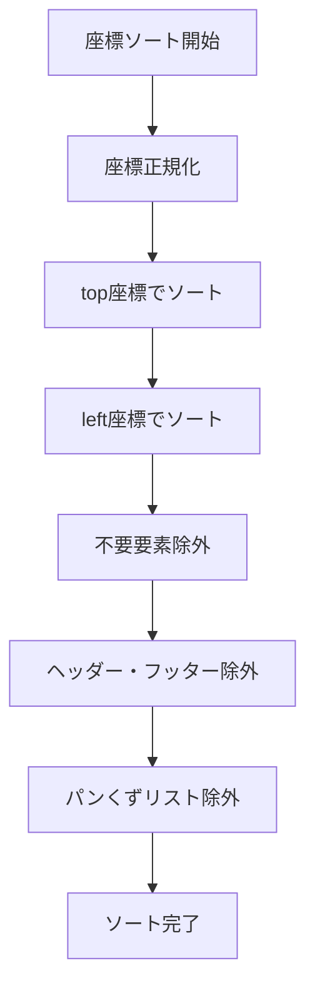
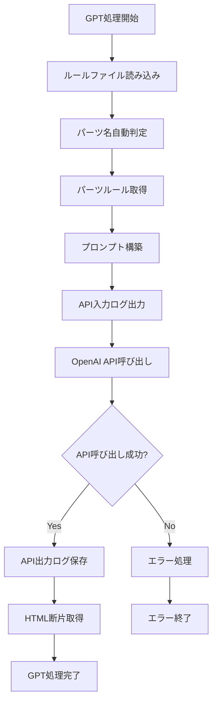
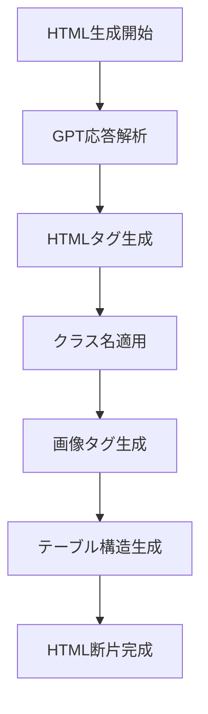
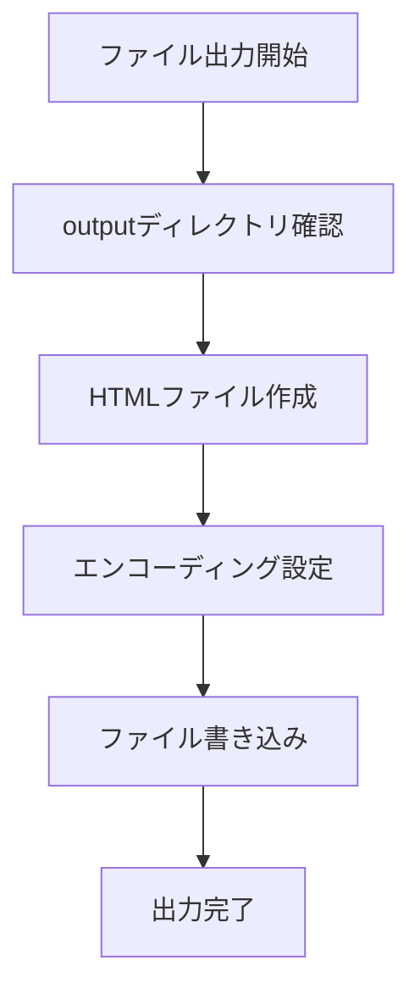

# pptx_to_html 処理フローチャート

## メイン処理（簡潔版）



## 詳細処理

### 1. PowerPointファイル読み込み


### 2. スライド要素抽出


### 3. 座標でソート


### 4. GPT API呼び出し


### 5. HTML断片生成


### 6. テンプレート適用
```mermaid
flowchart TD
    A[テンプレート適用開始] --> B[template.html読み込み]
    B --> C[{contents}置換]
    C --> D[{pagettl}置換]
    D --> E[HTML構造完成]
```

### 7. HTMLファイル出力

